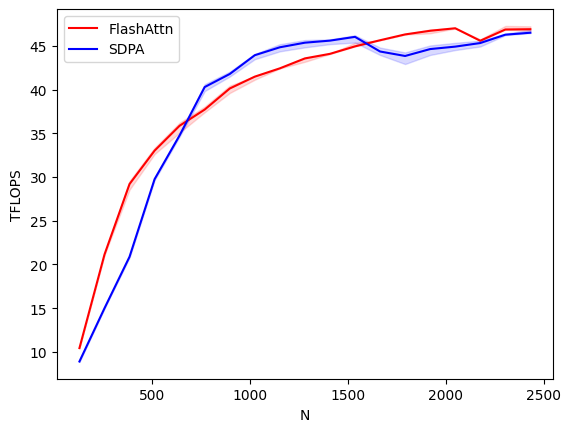
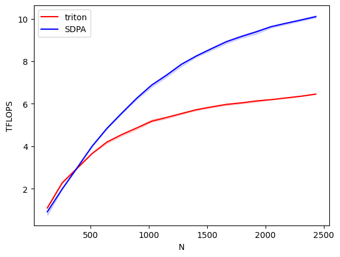

# triton-flashattn

The benchmark can be found at `benchmark.ipynb`.

| Forward Benchmark                | Backward Benchmark               |
|:--------------------------------:|:---------------------------------:|
|       |    |

The core idea is similar to GEMM. Since `HEAD_DIM` is usually small, we load in a chunk of queries, and stream chunks of keys and values. Online softmax allows us to calculate it all in one pass.

I wrote a lot of comments in the code, hopefully it would make things clear.

## Mathematical Derivation

Below is a full derivation of the backward pass for flash attention. At the end ([here](#-1-the-un-intended-way-of-calculating-flashattn-gradients)), I was trying to see if you can skip intermediate gradients (like `dA`) while still getting a workable formula to save register pressure, and well, the formula I get is not very workable.

### 0. Back prop for matmul

Given

$$
Y = WX, \quad y_{ij} = \sum_a w_{ia}x_{aj}
$$

Note that

$$
\begin{align*}
\dfrac{\partial y_{ij}}{\partial x_{mn}}&=\dfrac{\partial}{\partial x_{mn}}\left(\sum_aw_{ia}x_{aj}\right)\\
&=\sum_a\dfrac{\partial}{\partial x_{mn}}w_{ia}x_{aj}\\
&=\sum_a w_{ia}\delta_{m,a}\delta_{n,j}\\
&=w_{im}\delta_{n,j}
\end{align*}
$$

thus

$$
\begin{align*}
\dfrac{\partial L}{\partial x_{mn}}&=\sum_{ij}\dfrac{\partial L}{\partial y_{ij}}\dfrac{\partial y_{ij}}{\partial x_{mn}}\\
&=\sum_{ij}\dfrac{\partial L}{\partial y_{ij}}w_{im}\delta_{n,j}\\
&=\sum_{i}\dfrac{\partial L}{\partial y_{in}}w_{im}
\end{align*}
$$

therefore

$$
\left(\dfrac{\partial L}{\partial X}\right)=W^T\left(\dfrac{\partial L}{\partial Y}\right)
$$

and similarly,

$$
\dfrac{\partial L}{\partial W}=\dfrac{\partial L}{\partial Y} X^T
$$

### 1. Back Prop for flashattn

Given $O=\sigma(A-M)V=DV$, where $A = QK^T/\sqrt{d_k}$, we deduce:

$$
\dfrac{\partial L}{\partial V} = D^T\dfrac{\partial L}{\partial O}
$$

As for $Q, K$, first let $A=QK^T/\sqrt{d_k}$, then by the back prop of matmul, we have

$$
\dfrac{\partial L}{\partial Q}=\dfrac{1}{\sqrt{d_k}}\left(\dfrac{\partial L}{\partial A}\right)K
$$

$$
\dfrac{\partial L}{\partial K}=\left(\dfrac{\partial L}{\partial K^T}\right)^T=\dfrac{1}{\sqrt{d_k}}\left(\dfrac{\partial L}{\partial A}\right)^TQ
$$

$$
\dfrac{\partial L}{\partial D} = \dfrac{\partial L}{\partial O} V^T
$$

for softmax, we also have

$$
\dfrac{\partial D_{ab}}{\partial A_{cd}}=\delta_{a,c}D_{ab}(\delta_{b,d}-D_{ad})
$$

thus

```math
\begin{align*}
\dfrac{\partial L}{\partial A_{cd}}&=\sum_{ab}\dfrac{\partial L}{\partial D_{ab}}\dfrac{\partial D_{ab}}{\partial A_{cd}}\\
&=\sum_b\dfrac{\partial L}{\partial D_{cb}}D_{cb}(\delta_{b,d}-D_{cd})\\
&=D_{cd}\left(\dfrac{\partial L}{\partial D_{cd}}-\sum_bD_{cb}\dfrac{\partial L}{\partial D_{cb}}\right)\\
&=D_{cd}\left(\sum_{m}\dfrac{\partial L}{\partial O_{cm}}V_{dm}-\sum_bD_{cb}\sum_n\dfrac{\partial L}{\partial O_{cm}}V_{bm}\right)\\
&=D_{cd}\left(\sum_{m}\dfrac{\partial L}{\partial O_{cm}}V_{dm}-\sum_n\dfrac{\partial L}{\partial O_{cn}}O_{cn}\right)\\
&=D_{cd}\left(\left(\dfrac{\partial L}{\partial D}\right)_{cd}-\sum_n\dfrac{\partial L}{\partial O_{cn}}O_{cn}\right)
\end{align*}
```

This allows us to calculate all the gradients by propagating through $A$.

### 2. Masking

Causal masking ensures that the $m$-output token $O_m$ only depends on $K$ and $V$ positions $n\le m$. That is, each query attends only to the past or current tokens. Therefore the gradient $\frac{\partial L}{\partial V_n}$ and $\frac{\partial L}{\partial K_n}$ only receive contributions from $O_m$ with $m\ge n$.

The gradient $\frac{\partial L}{\partial Q_m}$ only depends on $O_m$, since attention depends on the current query only.


### -1. The un-intended way of calculating flashattn gradients

$$
\begin{align*}
\dfrac{\partial L}{\partial Q_{ij}}&=\sum_{abcd}\dfrac{\partial L}{\partial D_{ab}}\dfrac{\partial D_{ab}}{\partial F_{cd}}\dfrac{\partial F_{cd}}{\partial Q_{ij}}\\
&=\sum_{abcde}\dfrac{\partial L}{\partial O_{ae}}V_{be}\delta_{a,c}D_{ab}(\delta_{b,d}-D_{ad})\dfrac{1}{\sqrt{d_k}}\delta_{c,i}K_{dj}\\
&=\sum_{bde}\dfrac{\partial L}{\partial O_{ie}}V_{be}D_{ib}(\delta_{b,d}-D_{id})\dfrac{1}{\sqrt{d_k}}K_{dj}\\
&=\dfrac{1}{\sqrt{d_k}}\sum_{be}\dfrac{\partial L}{\partial O_{ie}}V_{be}D_{ib}\left(K_{bj}-\sum_dD_{id}K_{dj}\right)\\
&=\dfrac{1}{\sqrt{d_k}}\left(\sum_{be}\dfrac{\partial L}{\partial O_{ie}}V_{be}D_{ib}K_{bj}\right)-\left(\sum_d D_{id}K_{dj}\right)\Delta_i
\end{align*}
$$

$$
\begin{align*}
\dfrac{\partial L}{\partial K_{ij}} 
&= \sum_{abcd} \dfrac{\partial L}{\partial D_{ab}} \dfrac{\partial D_{ab}}{\partial F_{cd}} \dfrac{\partial F_{cd}}{\partial K_{ij}} \\
&= \sum_{abcde} \dfrac{\partial L}{\partial O_{ae}} V_{be} \delta_{a,c} D_{ab} (\delta_{b,d} - D_{ad}) \dfrac{1}{\sqrt{d_k}} \delta_{d,i} Q_{cj} \\
&= \sum_{abe} \dfrac{\partial L}{\partial O_{ae}} V_{be} D_{ab} (\delta_{b,i} - D_{ai}) \dfrac{1}{\sqrt{d_k}} Q_{aj} \\
&= \dfrac{1}{\sqrt{d_k}} \sum_{ae} \dfrac{\partial L}{\partial O_{ae}} D_{ai} Q_{aj} \left( V_{ie} - \sum_b D_{ab} V_{be} \right)\\
&= \dfrac{1}{\sqrt{d_k}} \sum_{a} D_{ai} Q_{aj}\sum_{e} \dfrac{\partial L}{\partial O_{ae}} \left( V_{ie} - O_{ae} \right)\\
&= \dfrac{1}{\sqrt{d_k}} \sum_{a} D_{ai} Q_{aj}\left(\left( \sum_{e} \dfrac{\partial L}{\partial O_{ae}}V_{ie}\right) - \Delta_a\right)
\end{align*}
$$

where

$$
\Delta_k=\sum_l\dfrac{\partial L}{\partial O_{kl}}O_{kl}
$$
